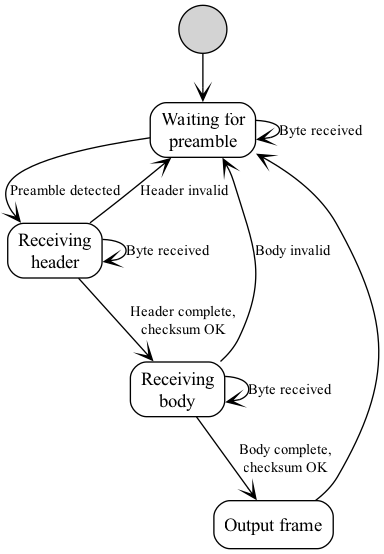

# python-tinylink
Frame-based streaming protocol for embedded applications.

[](https://github.com/basilfx/python-tinylink/actions/workflows/lint.yml)
[](https://github.com/basilfx/python-tinylink/actions/workflows/test.yml)

## Introduction
This is a general purpose Python module to provide a bi-directional frame-based
streaming protocol for low-speed embedded applications, such as serial
connected devices. It allowes the receiver to 'jump into' a stream of data
frames. Every frame starts with a preamble, so the receiver can synchronize.

A payload is optional.

The format of a frame is as follows:

```
| 0xAA 0x55 0xAA 0x55 | AA AA BB BB CC | XX XX .. .. .. .. XX XX YY YY YY YY |
| Preamble            | Header         | Body (optional)                     |

Fields:
A = Length
B = Flags
C = XOR checksum over header
X = Body payload (max. 65536 bytes)
Y = CRC32 checksum over header + body
```

The flags field can have arbitrary values, but the following flags are
reserved.

* `0x01 = RESET`
* `0x02 = ERROR`
* `0x04 = PRIORITY`

Error correction is not implemented and the bytes are not aligned. The
endianness is customizable.

## State chart diagram
Below is a simplified statechart diagram of the receiver.


## Installation
The latest development version can be installed via
`pip install git+https://github.com/basilfx/python-tinylink`.

## CLI
A simple serial CLI is included. When installed, run
`tinylink /dev/tty.PORT_HERE` to start it. You can use it to send raw bytes via
the link and display what comes back.

The CLI supports so-called modifiers to modify the outgoing data. For example,
the input `\flags=1 hello world` would send a reset frame with the value
'hello world'.

PySerial is required to run this CLI.

## Tests
To run the tests, please clone this repository and run `poetry run pytest`.

## Contributing
See the [`CONTRIBUTING.md`](CONTRIBUTING.md) file.

## License
See the [`LICENSE.md`](LICENSE.md) file (MIT license).
